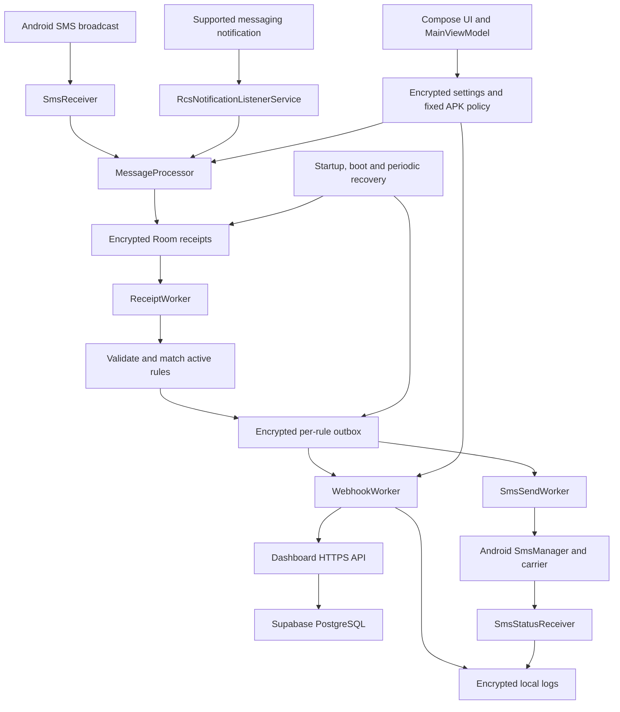
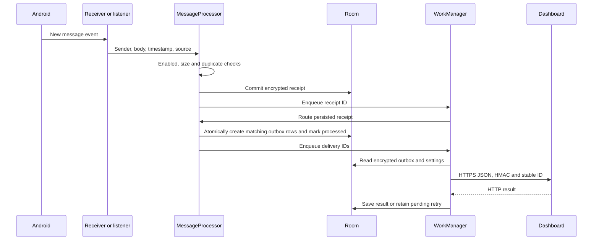
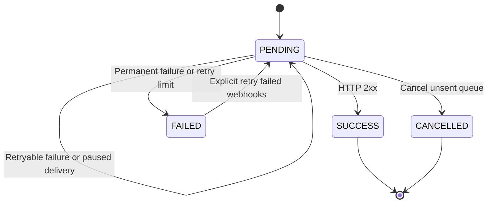
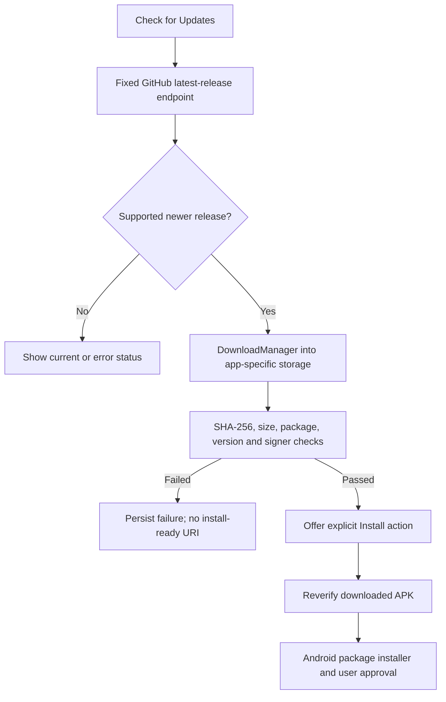

# SMS Sync Pro — Android

SMS Sync Pro captures incoming SMS and supported messaging notifications, routes them through configurable rules, and forwards them to SMS numbers or HTTPS webhooks. Messages enter an encrypted local queue before delivery. The companion dashboard verifies signed requests, decrypts message bodies, and provides searchable message, OTP and bank-activity views.

| Project | Link |
| --- | --- |
| Android source | [Sms-Sync-Pro-Android-app](https://github.com/workashish/Sms-Sync-Pro-Android-app) |
| Companion dashboard | [Sms-Sync-Pro-Dashboard](https://github.com/workashish/Sms-Sync-Pro-Dashboard) |
| APK downloads | [GitHub Releases](https://github.com/workashish/Sms-Sync-Pro-Android-app/releases) |
| Current documented APK | **2.2.1**, Android `versionCode` **5** |
| Application ID | `com.aistudio.smsforwarder.rndmxy.v2` |
| Android support | Minimum API **21**; compile/target API **35** |
| Distribution | Direct APK installation; no Google Play publishing workflow |

## Contents

- [Features and boundaries](#features-and-boundaries)
- [System architecture](#system-architecture)
- [Installation and first setup](#installation-and-first-setup)
- [Packaged defaults and fixed settings](#packaged-defaults-and-fixed-settings)
- [Rules and filters](#rules-and-filters)
- [Capture and routing workflow](#capture-and-routing-workflow)
- [Queues, delivery states and recovery](#queues-delivery-states-and-recovery)
- [Webhook protocol and encryption](#webhook-protocol-and-encryption)
- [SMS forwarding and commands](#sms-forwarding-and-commands)
- [Local storage, privacy and retention](#local-storage-privacy-and-retention)
- [Configuration import and export](#configuration-import-and-export)
- [Verified APK updates](#verified-apk-updates)
- [Source map](#source-map)
- [Development, testing and releases](#development-testing-and-releases)
- [Troubleshooting](#troubleshooting)
- [Verification status and future work](#verification-status-and-future-work)

## Features and boundaries

Implemented features:

- Create, edit, enable, disable and delete SMS or webhook forwarding rules.
- Match all messages, literal text, or bounded RE2/J regular expressions.
- Capture SMS broadcasts, including assembled multipart text.
- Optionally capture Google Messages and Samsung Messages notifications, including available RCS text.
- Store encrypted receipts and per-rule delivery jobs; recover pending work after application restarts and boot.
- Forward encrypted JSON with HMAC authentication and stable delivery IDs.
- Show delivery logs, pending work, permission/SIM status and enabled/paused state.
- Pause/resume, cancel unsent work and explicitly retry failed webhooks.
- Support authorized `STATUS` SMS commands.
- Import/export editable configuration with validation and atomic merging.
- Download and verify signed APK updates from the fixed official GitHub release source.

This is a forwarding utility, not an implementation of the RCS protocol or a replacement for Android's default SMS application. It does not read historical inbox contents, support MMS media, or guarantee background execution after force-stop. Message classification is heuristic. A successful webhook means an HTTP 2xx response; arbitrary third-party endpoints must define their own storage/processing guarantees.

## System architecture



The app uses Kotlin, Jetpack Compose, a ViewModel/Flow UI, Hilt dependency injection, Room persistence and WorkManager scheduling. `SmsSyncApp` provides the Hilt worker factory; the default AndroidX WorkManager initializer is removed so custom initialization can supply it.

Receivers perform brief asynchronous capture using `goAsync()`. Network and carrier delivery run in workers rather than inside the receiver. WorkManager receives IDs instead of large or sensitive message bodies.

## Installation and first setup

1. Download the APK from [Releases](https://github.com/workashish/Sms-Sync-Pro-Android-app/releases/latest). The repository also contains [apk/sms-sync-pro.apk](apk/sms-sync-pro.apk) and its [SHA-256 file](apk/sms-sync-pro.apk.sha256).
2. Allow installation from the browser/file manager when Android asks, and install the APK.
3. Open the app and grant **Receive SMS** permission to capture incoming SMS.
4. Check the default `sms sync dashboard` rule. It targets `https://thesms.vercel.app/api/webhooks/incoming`.
5. Complete the companion dashboard's database and environment setup **before** testing production delivery.
6. If forwarding by SMS, grant **Send SMS**, ensure a ready SIM exists, and choose a SIM or configure Android's default SMS SIM.
7. For messaging-notification capture, enable the option and grant Android notification-listener access.
8. Use the webhook rule's test action and inspect Logs and the dashboard. A test sends synthetic text to the chosen target; it is a real request.

### Permissions

| Permission/access | Purpose |
| --- | --- |
| Receive SMS | Receive new SMS broadcasts |
| Send SMS | SMS targets and authorized STATUS replies |
| Read phone state | SIM/subscription information where needed |
| Notification listener access | Supported messaging-notification capture; granted through Android Settings |
| Post notifications | App/update notifications on applicable Android versions |
| Internet / network state | Webhook delivery and release metadata/downloads |
| Receive boot completed / wake lock | Work scheduling and recovery |
| Ignore battery optimization request | Optional help for background scheduling; not a guarantee |
| Install unknown apps | Explicit installation of a verified downloaded update |
| Legacy storage permission | Manifest compatibility on older Android versions, capped at API 28 |

The app does not use an indefinite foreground service. Device power policies, connectivity and user permissions still govern execution.

## Packaged defaults and fixed settings

[default_config.json](app/src/main/assets/default_config.json) is the installation seed:

```json
{
  "settings": {
    "globalEnable": true,
    "includeDeviceModel": true,
    "retryFailedWebhooks": true,
    "webhookTimeout": 8,
    "webhookSecret": "YOUR_HMAC_SECRET_KEY",
    "preventScreenCapture": false,
    "aesEncryptionKey": "YOUR_AES_PASSWORD",
    "customWebhookTemplate": "",
    "enableSmsCommands": true
  },
  "rules": [
    {
      "name": "sms sync dashboard",
      "type": "WEBHOOK",
      "target": "https://thesms.vercel.app/api/webhooks/incoming",
      "keywordFilter": ""
    }
  ]
}
```

The rule is active when `isActive` is omitted. Rules are seeded when the database is first created; compatible upgrades do not recreate deleted rules or overwrite ordinary user edits.

Additional runtime defaults are notification capture off, no authorized command senders, default SIM selection (`-1`), and 30-day retention.

### Fixed APK policy introduced in 2.2.1

| Setting | Effective source | Can Settings or imports change it? |
| --- | --- | --- |
| Update URL | `https://api.github.com/repos/workashish/Sms-Sync-Pro-Android-app/releases/latest` in `FixedSettings` | No |
| HMAC secret | `webhookSecret` in the packaged asset | No |
| AES password | `aesEncryptionKey` in the packaged asset | No |
| Other supported settings/rules | Encrypted configuration and Room rules | Yes |

[FixedSettings.kt](app/src/main/kotlin/com/example/data/FixedSettings.kt) enforces this policy beyond the UI: settings reads normalize the values, stored legacy overrides are reset, imports ignore those fields, and public setters/editors were removed. Export omits all three fixed values.

The requested HMAC/AES strings are **public placeholders**. They remain embedded exactly as requested. A private deployment should change the packaged values, build a new signed APK and set matching dashboard environment values. There is no Settings editor for rotating them. An embedded APK secret can be extracted; hiding the editor does not create a per-device credential system.

## Rules and filters

Every rule has a name, type (`SMS` or `WEBHOOK`), target, optional `keywordFilter`, and `isActive` flag. Each matching active rule creates its own delivery, so several rules can intentionally forward one message to several destinations.

| Filter | Meaning |
| --- | --- |
| Empty | Match every captured message |
| `bank` | Case-insensitive substring search in sender **or** body |
| `/OTP [0-9]{6}/` | Case-sensitive RE2/J search |
| `/payment/i` | Case-insensitive RE2/J search |

Filters are bounded to 512 characters. RE2/J rejects unsupported lookaround/backreferences and avoids catastrophic backtracking. Webhook targets must pass URL validation; release delivery uses HTTPS, while debug delivery permits HTTP fixtures. SMS targets must pass phone-number validation.

Rules match at routing time. Editing a rule after its delivery has entered the outbox does not rewrite that queued delivery's saved destination/body.

## Capture and routing workflow



Capture rejects blank content, app-forwarding loop markers and bodies larger than **256 KiB UTF-8**. When forwarding is paused, newly received messages are not captured for later forwarding; already queued messages remain.

Event/body fingerprints use a local random HMAC key. Repeated event identities are deduplicated. Cross-source deduplication compares body fingerprints within approximately **±90 seconds**; it is a heuristic, not a universal identity system, and can suppress identical bodies from different sources.

Notification capture accepts only `com.google.android.apps.messaging` and `com.samsung.android.messaging`. It skips group summaries, ongoing notifications and self-sent MessagingStyle entries. It extracts the newest available entry or falls back to notification title/text, with a persisted fallback cache. Missing timestamps and redacted content limit what can be reconstructed.

## Queues, delivery states and recovery

A receipt represents a captured event. An outbox row represents one rule's delivery. Delivery UUIDs derive from receipt ID, rule ID and delivery type, keeping identities stable across retries even when AES generates fresh ciphertext.

### Webhook state



`RETRYING` is a log status; the outbox remains `PENDING`. Network errors and HTTP **408, 429 and 5xx** are retryable. Ordinary other non-2xx responses fail without automatic retry. The worker allows up to **three retries after the initial attempt** when retrying is enabled. Delivery backoff is exponential, starting at one minute. Receipt routing uses linear backoff. Android can delay both schedules.

HTTP uses a shared OkHttp connection pool, bounded total-call/connect/read timeouts, no automatic redirects, no implicit transport retries, and bounded error-body previews. The configured timeout is 1–60 seconds; default 8.

### Recovery and controls

- Startup and boot schedule recovery; periodic maintenance requests run at a 15-minute interval, subject to Android scheduling.
- Recovery pages through unprocessed receipts and pending outbox items and recreates missing jobs.
- Pause retains pending work; resume reschedules it. An already executing request may finish.
- **Cancel Unsent Queue** marks pending outbox jobs cancelled and unprocessed receipts processed; it does not retract a request already sent.
- **Retry Failed Webhooks** resets failed webhook jobs to pending with the same IDs and a fresh attempt counter.
- Synthetic webhook tests bypass global pause and do not use the normal automatic retry loop.

## Webhook protocol and encryption

Version 1 standard envelope:

```json
{
  "schema_version": 1,
  "id": "2c9d7a0a-7d69-4e61-8a8b-2c11a69723fa",
  "encryption": "aes-256-gcm-pbkdf2-sha256-v1",
  "type": "otp",
  "sender": "BANK",
  "body": "saltHex:ivHex:ciphertextAndTagHex",
  "timestamp": 1791417600000,
  "time": "2026-10-08T00:00:00.000Z",
  "metadata": { "device_model": "Pixel" }
}
```

The body above illustrates the encoding; it is not a decryptable test ciphertext. `timestamp` is original receipt time in milliseconds. `type` is `message`, `otp` or `bank`. Device model is included only when enabled.

| Mechanism | Implementation |
| --- | --- |
| Transport | HTTPS in release builds |
| Authentication | HMAC-SHA256 over the **exact serialized UTF-8 request body** |
| Signature header | `x-hmac-signature`, lowercase hex digest |
| Retry identity header | `Idempotency-Key`, same stable delivery UUID as envelope `id` |
| Key derivation | PBKDF2-HMAC-SHA256, 10,000 iterations, 32-byte key |
| Body encryption | AES-256-GCM, random 16-byte salt, 12-byte IV, 16-byte tag |
| Wire encoding | `saltHex:ivHex:ciphertextAndTagHex` |

With the current fixed non-empty AES password, messages are encrypted. The protocol also supports `encryption: "none"` for other senders/build configurations. Extracted OTP/amount values are omitted from the encrypted Android envelope; the dashboard derives them after decryption.

**This is not end-to-end encryption against the dashboard server.** The dashboard knows the AES password and stores decrypted content. Sender, category, timestamp and optional device metadata are not protected by body encryption, although HTTPS and HMAC protect transport/authentication.

### Custom JSON templates

Supported placeholders: `{sender}`, `{message}`, `{body}`, `{device_model}`, `{id}`, `{timestamp}`, `{encryption}`. Substitution traverses nested objects/arrays; a standalone timestamp placeholder becomes a JSON number.

```json
{
  "sender": "{sender}",
  "body": "{body}",
  "metadata": { "device_model": "{device_model}" }
}
```

For targets ending in `/api/webhooks/incoming`, templates must preserve sender/body placeholders; the worker adds the required version, ID, encryption and timestamp fields. Other webhooks must implement compatible HMAC/decryption/idempotency themselves. Keep the default empty template for the standard dashboard flow.

## SMS forwarding and commands

SMS forwarding prepends `[SMS Sync Pro forwarded]`, then sender/body. Capture skips messages beginning with this marker to reduce forwarding loops between installations.

`SmsSendWorker` checks permission, ready SIM and selected/default subscription. It splits multipart SMS and creates explicit sent/delivery PendingIntents for each part. `SmsStatusReceiver` aggregates those callbacks:

| Status | Meaning |
| --- | --- |
| `SENDING` | Claimed for submission; carrier outcome pending |
| `SENT` | All parts reported successfully sent; does not prove recipient delivery |
| `DELIVERED` | All parts reported delivered |
| `FAILED` | Permission, SIM, send or delivery-report error |
| `UNKNOWN` | No definitive carrier result; maintenance marks stale SENDING jobs after about ten minutes |

Uncertain carrier sends are not automatically resent. SMS uses the carrier and may incur charges; webhook AES does not encrypt carrier-forwarded SMS.

Only `STATUS` commands are implemented. The enable switch defaults to true, but an empty authorized-sender list permits **no replies**. Authorized numbers are normalized to digits, separated by commas/newlines/semicolons. An authorized STATUS reply reports battery and pending deliveries. Unsupported LOCATION/REBOOT commands do not execute privileged actions. Sender allowlisting is not cryptographic sender authentication.

## Local storage, privacy and retention

Room schema version **4** uses:

| Table | Purpose |
| --- | --- |
| `forwarding_rules` | Editable rule definitions; rule fields are not encrypted by LocalVault |
| `app_config` | Single encrypted JSON configuration, including local fingerprint key |
| `receipts` | Encrypted sender/body with event/body fingerprints and processing state |
| `outbox` | Encrypted saved delivery payload, status, attempts and attempt time |
| `sms_parts` | Multipart carrier callback state |
| `sms_logs` | Encrypted sender/message/rule/target/status; timestamp/index fields remain queryable |

LocalVault uses device-bound AES-GCM through Android Keystore on API 23+. API 21/22 wrap a random AES key using a Keystore RSA key. The entire SQLite file is not encrypted; the sensitive payload/log fields are. Cloud backup and device transfer are disabled because ciphertext depends on device keys.

Migrations preserve data: 1→2 adds rule indexing; 2→3 creates durable/config tables and encrypts existing log content; 3→4 adds attempt tracking. There is no destructive-migration fallback.

Maintenance bounds logs to **1,000** and configurable **1–365 days**, default 30. Processed receipts older than two days are pruned. Non-pending/non-SENDING outbox items follow retention. Pending work remains until resolved/cancelled. These operations run during maintenance, not at an exact wall-clock deadline.

Uninstalling clears local data and keys. A settings export does not back up message history or restore encrypted database files to another device.

## Configuration import and export

Export includes editable settings and rules with `schema_version: 1` and `secretsIncluded: false`. It omits fixed HMAC/AES/update values, internal fingerprint key and message history.

Import supports at most **1 MiB**, **500 rules**, rule names up to **128 characters** and filters up to **512 characters**. It validates the full document before applying changes: field types/ranges, rule types/targets, filters and template JSON. Unknown editable settings are rejected; fixed fields are ignored for compatibility with old backups.

Settings and rule merges commit in one Room transaction. Matching rules are updated rather than duplicated; importing is a merge, not deletion/replacement of every current rule. Pending recovery is scheduled afterward.

## Verified APK updates



Drafts/prereleases are skipped. Numeric tags such as `v2.2.1` and supported `-build` suffixes are compared with the installed version. GitHub APK assets must supply a SHA-256 `digest`. Verification rejects files over 100 MiB, wrong checksums, wrong package IDs, non-increasing Android version codes or incompatible signing certificates. Android performs the final installation checks.

Download state/errors survive UI recreation. Installation requires an explicit action and may require Android's unknown-source permission. Release URLs use HTTPS. The update URL is not editable or importable.

The current releases use a new persistent key because the original Google AI Studio signing key was unavailable. They cannot update an older differently signed APK; export editable configuration and plan a one-time reinstall. Future releases **must reuse the current key** and increase versionCode. Keep keystores/passwords outside Git and maintain an offline backup.

## Source map

Paths below are relative to `app/src/main/kotlin/com/example/` unless stated otherwise.

| Area | Files |
| --- | --- |
| UI and state | `MainActivity.kt`, `ui/Screens.kt`, `ui/PrivacyRoutingControls.kt`, `ui/PersistedTextField.kt`, `viewmodel/MainViewModel.kt` |
| Dependency setup | `SmsSyncApp.kt`, `di/AppModule.kt`, `di/AppServices.kt` |
| Storage/configuration | `data/AppDatabase.kt`, `Entities.kt`, `SmsDao.kt`, `SmsRepository.kt`, `SettingsDataStore.kt`, `FixedSettings.kt`, `DefaultConfig.kt`, `LocalVault.kt` |
| Import/validation | `data/ConfigImport.kt`, `ExportImportManager.kt`, `RuleValidation.kt` |
| Capture/routing | `receiver/SmsReceiver.kt`, `receiver/BootReceiver.kt`, `service/RcsNotificationListenerService.kt`, `processor/MessageProcessor.kt`, `SafeFilter.kt`, `MessageClassification.kt` |
| Delivery/recovery | `worker/ReceiptWorker.kt`, `WebhookWorker.kt`, `SmsSendWorker.kt`, `QueueRecoveryWorker.kt`, `QueueScheduler.kt` |
| Wire protocol | `worker/WebhookCrypto.kt`, `WebhookPayload.kt`, `WebhookTransport.kt` |
| Carrier results | `receiver/SmsStatusReceiver.kt` |
| Updates | `updater/AppUpdater.kt`, `UpdateMetadata.kt`, `VersionComparison.kt`, `DownloadReceiver.kt`, `ApkVerifier.kt` |
| APK defaults | `app/src/main/assets/default_config.json` |
| Tests | `app/src/test/`, `app/src/androidTest/` |
| Build/release | `app/build.gradle.kts`, `gradle/wrapper/`, `scripts/build_release.py`, `.github/workflows/` |

## Development, testing and releases

### Local build

Install JDK **17**, Android SDK platform **35**, build tools and an emulator or device. The Gradle wrapper pins **8.9** and verifies the distribution checksum. Set your SDK location through `ANDROID_HOME` or an untracked `local.properties` file.

```sh
git clone https://github.com/workashish/Sms-Sync-Pro-Android-app.git
cd Sms-Sync-Pro-Android-app
./gradlew :app:assembleDebug :app:testDebugUnitTest :app:lintDebug
```

Debug output: `app/build/outputs/apk/debug/app-debug.apk`. A standard debug certificate differs from the release certificate; do not expect a debug APK to replace the signed release without an intentional signing setup.

### Device tests

```sh
./gradlew :app:assembleDebugAndroidTest :app:connectedDebugAndroidTest
```

The large-message/pause delivery scenario requires the companion dashboard fixture reachable from the emulator at `http://10.0.2.2:4320`, backed by a disposable PostgreSQL database. See the dashboard's test instructions. Disable real forwarding targets and use synthetic messages. The fixture-dependent test is not an offline unit test.

Unit tests cover configuration/default policy, imports, migrations, safe filters, parsing, encryption interoperability, templates and update metadata/version handling. Device tests cover Keystore, atomic import, durable large payloads, pause/resume, unauthorized commands and fixed-setting migration.

### Signed release build

Provide an existing protected PKCS12 keystore with alias `upload` and a password file **outside the repository**:

```sh
python3 scripts/build_release.py \
  --keystore /secure/path/sms-sync-release.p12 \
  --password-file /secure/path/password.txt \
  --with-tests
```

Release output: `app/build/outputs/apk/release/app-release.apk`. `--version-code` and `--version-name` override build values; `--gradle` selects a Gradle executable. `--signed-debug` is only for same-key debug/instrumentation testing. Signing values enter child-process environment variables without being printed. Never commit the private key/password.

The build also recognizes `KEYSTORE_PATH`, `STORE_PASSWORD`, `KEY_PASSWORD`, `SMS_SYNC_VERSION_CODE`, `SMS_SYNC_VERSION_NAME` and `SMS_SYNC_SIGNED_TEST`.

### GitHub workflows

- [Verify Android](.github/workflows/verify.yml): JDK 17, debug assembly, unit tests and lint on pushes/PRs. It does not run an emulator or prove carrier behavior.
- [Publish signed APK](.github/workflows/release.yml): manual dispatch with numeric version tag/versionCode; requires `RELEASE_KEYSTORE_B64` and `RELEASE_KEYSTORE_PASSWORD` repository secrets. It creates a signed APK and a GitHub release using `RELEASE_NOTES.md`.

Before publishing, verify ZIP integrity/signatures, update the version, and retain a SHA-256 checksum. For a manual release, `gh release create` can attach the APK and checksum with `--notes-file`. Release automation does not automatically provision Supabase/Vercel.

## Troubleshooting

| Symptom | Check |
| --- | --- |
| No incoming SMS | Receive SMS permission, forwarding enabled, active rule, force-stop and device restrictions |
| RCS/notification message missing | Capture toggle, notification access, supported package, summaries/self messages, Android redaction |
| Delivery waits or retries | Network, proxy, HTTPS target, timeout, WorkManager restrictions and response shown in Logs |
| Webhook 401 | Dashboard `APP_HMAC_SECRET` must exactly match the fixed packaged secret; sign raw JSON bytes |
| Webhook 400/decryption failure | Matching `APP_AES_PASSWORD`, encryption envelope, template sender/body/version fields |
| Webhook 500/503 | Dashboard server configuration and full Supabase schema migration |
| Dashboard login unavailable | See the dashboard README's dedicated database/login recovery steps |
| SMS send failed | Send SMS permission, ready SIM, chosen/default SIM, subscription and carrier result |
| SENT but no delivery report | SENT is not DELIVERED; reports depend on carrier/device support |
| Update unavailable | Network, published numeric-tag release, APK asset and GitHub digest/rate limits |
| Update cannot install | Check package/version/signer; an original differently signed installation needs migration/reinstall |
| Fixed settings cannot be changed | Intentional 2.2.1 policy; change packaged configuration and rebuild for new values |
| Backup does not contain messages | Export is configuration-only; device-bound history is not transferable through it |

## Verification status and future work

The 2.2.1 local checks passed assembly/lint, **18 unit tests** and **three targeted emulator instrumentation tests** for fixed settings, atomic imports and Keystore. Earlier acceptance also covered a 20,000-character queued message, pause/resume, unauthorized commands, bad-checksum rejection and a same-key signed update. Emulator verification used API 37; this is not a claim that every API/OEM/carrier was tested.

See [acceptance results](docs/EMULATOR_TEST_RESULTS.md), [audit](docs/PROJECT_AUDIT.md) and [work checklist](docs/WORK_CHECKLIST.md). These include historical evidence and explicit limits. Live Supabase/Vercel setup, real carrier/dual-SIM/RCS, OEM power behavior and provider backup policies require deployment/device verification.

A native macOS companion, APNs delivery, device pairing, per-device credentials, multi-user accounts and remote configuration are proposed future modules, **not features shipped by this repository**.
